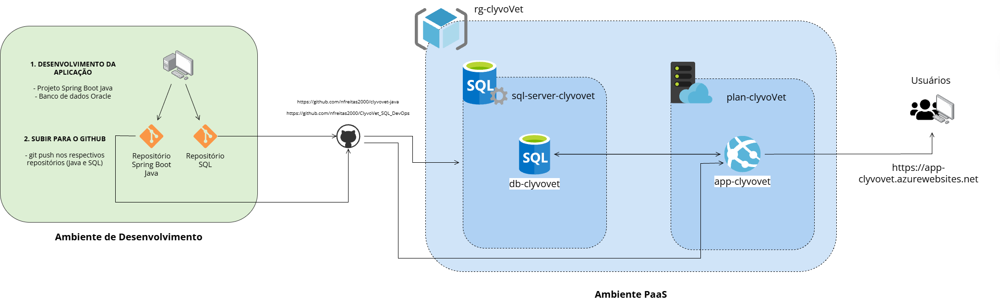

# SuperVet

## Descrição da Solução

O **SuperVet** é uma plataforma digital que integra a comunicação entre tutores de animais e médicos veterinários, resolvendo o problema de históricos médicos fragmentados e do cuidado exclusivamente reativo. A solução centraliza a gestão de **prontuários**, **agendamentos** e **monitoramento preventivo (vacinas)**, oferecendo:

- Para os **tutores**: acompanhamento da saúde dos pets, histórico de vacinas e consultas.
- Para os **veterinários**: organização de fluxos clínicos, agenda e prontuários dos pacientes.

O sistema foi desenvolvido em **Java 21 com Spring Boot**, seguindo uma arquitetura escalável, preparada para conformidade com a **LGPD** e para futura integração com dispositivos **IoT**. Nesta entrega, a aplicação está publicada na nuvem (**Azure App Service**), com persistência de dados em banco relacional gerenciado (**Azure SQL Database**).

## Benefícios para o Negócio

- **Elimina a fragmentação de informações**: tutores e veterinários acessam o mesmo histórico centralizado, evitando retrabalho e perda de dados clínicos.
- **Transforma o cuidado de reativo para preventivo**: o controle de vacinas e monitoramento contínuo permite intervenções antes que problemas de saúde se agravem.
- **Otimiza a rotina clínica**: agendamentos organizados reduzem conflitos de agenda e aumentam a eficiência do atendimento veterinário.
- **Escalabilidade e segurança**: hospedagem em nuvem (PaaS) reduz custos de infraestrutura própria e garante disponibilidade, com trilha pronta para atender exigências de privacidade (LGPD).
- **Preparação para o futuro**: arquitetura pensada para incorporar dispositivos IoT (ex: coleiras inteligentes, sensores de saúde), ampliando o monitoramento em tempo real.

## Arquitetura da Solução



- **Aplicação**: Java 21 + Spring Boot, empacotada como `.jar` via Gradle, publicada diretamente no App Service (sem containerização).
- **Banco de dados**: Azure SQL Database, criado via Azure CLI, populado a partir do script `script_bd.sql`.
- **Infraestrutura**: todos os recursos (Resource Group, App Service Plan, Web App, SQL Server, SQL Database, regras de firewall) provisionados via **Azure CLI**.

## Tecnologias Utilizadas

| Camada | Tecnologia |
|---|---|
| Linguagem/Framework | Java 21 + Spring Boot |
| Build | Gradle |
| Banco de Dados | Azure SQL Database (SQL Server) |
| Hospedagem | Azure App Service (Linux, plano B1) |
| Infraestrutura como comando | Azure CLI |

### Pré-requisitos

- [Azure CLI](https://learn.microsoft.com/cli/azure/install-azure-cli) instalado e autenticado (`az login`)
- Git instalado
- JDK 21 instalado
- Ferramenta `sqlcmd` instalada (ou Azure Data Studio) para rodar o DDL

### 1. Clonar os repositórios

```bash
git clone https://github.com/nfreitas2000/clyvovet-java
git clone https://github.com/nfreitas2000/ClyvoVet_SQL_DevOps sql-repo
```

### 2. Registrar o provedor de Web Apps na assinatura Azure

```bash
az provider register --namespace Microsoft.Web
```

### 3. Criar o Grupo de Recursos

```bash
az group create \
  --name rg-clyvoVet \
  --location canadacentral
```

### 4. Criar o Servidor Azure SQL

```bash
az sql server create \
  --name sql-server-clyvovet \
  --resource-group rg-clyvoVet \
  --location canadacentral \
  --admin-user <SEU_USUARIO_ADMIN> \
  --admin-password '<SUA_SENHA_FORTE>' \
  --enable-public-network true
```

### 5. Criar o Banco de Dados Azure SQL (camada Basic)

```bash
az sql db create \
  --resource-group rg-clyvoVet \
  --server sql-server-clyvovet \
  --name db-clyvovet \
  --service-objective Basic \
  --backup-storage-redundancy Local \
  --zone-redundant false
```

### 6. Liberar acesso de rede ao banco

```bash
az sql server firewall-rule create \
  --resource-group rg-clyvoVet \
  --server sql-server-clyvovet \
  --name AllowFullAccess \
  --start-ip-address 0.0.0.0 \
  --end-ip-address 255.255.255.255
```

### 7. Executar o DDL do banco de dados

```bash
sqlcmd -S sql-server-clyvovet.database.windows.net \
  -d db-clyvovet \
  -U <SEU_USUARIO_ADMIN> \
  -P '<SUA_SENHA_FORTE>' \
  -i ./sql-repo/script_bd.sql
```

### 8. Criar o Plano do App Service (Linux, SKU B1)

```bash
az appservice plan create \
  --name plan-clyvovet \
  --resource-group rg-clyvoVet \
  --location canadacentral \
  --is-linux \
  --sku B1
```

### 9. Criar o Web App para Java 21

```bash
az webapp create \
  --name app-clyvovet \
  --resource-group rg-clyvoVet \
  --plan plan-clyvovet \
  --runtime "JAVA:21-java21"
```

### 10. Configurar as variáveis de conexão com o banco no App Service

```bash
az webapp config appsettings set \
  --resource-group rg-clyvoVet \
  --name app-clyvovet \
  --settings \
    SPRING_DATASOURCE_URL='jdbc:sqlserver://sql-server-clyvovet.database.windows.net:1433;database=db-clyvovet;encrypt=true;trustServerCertificate=true;loginTimeout=30;' \
    SPRING_DATASOURCE_USERNAME='<SEU_USUARIO_ADMIN>' \
    SPRING_DATASOURCE_PASSWORD='<SUA_SENHA_FORTE>' \
    SPRING_JPA_PROPERTIES_HIBERNATE_DIALECT='org.hibernate.dialect.SQLServerDialect' \
    SPRING_JPA_DATABASE_PLATFORM='org.hibernate.dialect.SQLServerDialect' \
    WEBSITES_CONTAINER_STARTUP_TIME_LIMIT='1800' \
    WEBSITES_PORT='80'
```

### 11. Build e Deploy da aplicação (Gradle)

```bash
cd clyvovet-java

# Dar permissão de execução ao Gradle Wrapper
chmod +x ./gradlew

# Gerar o .jar executável em build/libs/
./gradlew clean bootJar -x test

# Deploy do .jar gerado no App Service
az webapp deploy \
  --resource-group rg-clyvoVet \
  --name app-clyvovet \
  --src-path ./build/libs/*.jar \
  --type jar
```

### 12. Validar o Deploy

Após o deploy, a aplicação estará disponível em:

```
https://app-clyvovet.azurewebsites.net
```

---

## Vídeo de Demonstração

Link do vídeo no YouTube: [`<LINK_DO_VIDEO>`](https://youtu.be/6QHIrIeWvVE)

## Repositórios

- Aplicação: https://github.com/nfreitas2000/clyvovet-java
- Scripts SQL: https://github.com/nfreitas2000/ClyvoVet_SQL_DevOps

## Integrantes

| Nome Completo | RM |
|---|---|
| `João Victor Gomes de Souza` | `RM560907` |
| `Lucas Barranha Giannini` | `RM564508` |
| `Maria Luiza Alves de Aquino` | `RM561802` |
| `Natan Freitas de Moraes` | `RM564992` |
